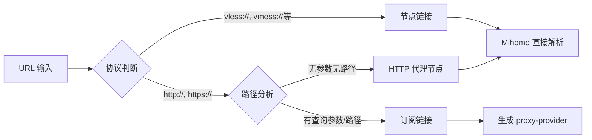

# SubConverter-Extended

<div align="center">

[](https://github.com/Aethersailor/SubConverter-Extended/releases)
[](https://hub.docker.com/r/aethersailor/subconverter-extended)
[](LICENSE)
[](https://github.com/MetaCubeX/mihomo)

**现代化的订阅转换工具 | 完美兼容 Mihomo 内核**

[特性](#-核心特性) • [快速开始](#-快速开始) • [使用文档](#-使用文档) • [Docker 部署](#-docker-部署)

</div>

---

## 📖 项目简介

SubConverter-Extended 是基于 [subconverter v0.9.9](https://github.com/asdlokj1qpi233/subconverter) 的增强版本，专为 [Mihomo](https://github.com/MetaCubeX/mihomo) 内核和 [OpenClash](https://github.com/vernesong/OpenClash) 优化，提供更现代、更强大的订阅转换服务。

### 🎯 设计理念

- **100% Mihomo 兼容**：集成 Mihomo 内核解析器，原生支持所有协议
- **智能链接识别**：自动区分订阅链接和节点链接，采用最优处理策略
- **Proxy-Provider 优先**：订阅链接生成 `proxy-provider` 配置，避免配置文件膨胀
- **现代化架构**：优化的工作流、自动化更新、完善的容器化支持

---

## ✨ 核心特性

### 🚀 相对原版的重大改进

| 功能 | 原版 Subconverter | SubConverter-Extended |
|------|-------------------|------------------------|
| **协议支持** | 手动维护解析器 | 集成 Mihomo 内核，自动支持所有新协议 |
| **订阅链接处理** | 下载并解析节点 | 生成 `proxy-provider`，由客户端定时拉取 |
| **节点链接处理** | 有限的协议支持 | Mihomo 解析器 100% 兼容 |
| **配置文件大小** | ❌ 展开所有规则和节点 | ✅ 使用 provider，配置文件精简 |
| **新协议支持** | ❌ 需要代码更新 | ✅ Mihomo 更新即支持 |
| **参数透传** | ⚠️ 未知参数可能丢失 | ✅ 完整保留所有参数 |

### 🔥 独特功能

#### 1. 智能 URL 识别



**识别规则**：

- **节点链接**：`vless://`, `vmess://`, `ss://`, `ssr://`, `trojan://`, `hysteria://`, `hysteria2://`, `tuic://`, `snell://`...
- **订阅链接**：`http(s)://` 且包含查询参数或路径
- **HTTP 代理**：`http(s)://` 但无参数无路径（如 `http://proxy.com:8080`）

#### 2. Proxy-Provider 模式

订阅链接**不再下载解析**，而是生成客户端可直接使用的配置：

```yaml
proxy-providers:
  provider_1:
    type: http
    url: https://your-subscription-url
    interval: 3600
    path: ./providers/provider_1.yaml
    health-check:
      enable: true
      interval: 600
      url: http://www.gstatic.com/generate_204
```

**优势**：

- ✅ 配置文件大小从 MB 级降至 KB 级
- ✅ 订阅更新由客户端控制，无需重新转换
- ✅ 支持订阅健康检查和自动切换

#### 3. Mihomo 内核集成

直接使用 Mihomo Go 库解析节点，确保：

- ✅ 支持 Mihomo 的所有协议（包括 `hysteria2`, `tuic`, `linksb` 等）
- ✅ 参数完全兼容，无需手动适配
- ✅ 新协议零延迟支持（跟随 Mihomo 更新）

---

## 🔧 链接处理机制详解

### 订阅链接（Subscription URL）

**识别条件**：

- HTTP/HTTPS 协议
- 包含查询参数（如 `?token=xxx`）
- 或包含路径（如 `/api/v1/sub`）

**处理流程**：

```
订阅链接 → 识别为订阅 → 生成 proxy-provider 配置 → 包含在最终 YAML 中
```

**示例**：

```bash
# 输入订阅链接
https://api.example.com/sub?token=abc123

# 生成的配置（片段）
proxy-providers:
  provider_1:
    type: http
    url: https://api.example.com/sub?token=abc123
    interval: 3600
    path: ./providers/provider_1.yaml
```

### 节点链接（Proxy Link）

**识别条件**：

- 以特定协议前缀开头（`vless://`, `vmess://`, `ss://` 等）
- 或为无参数的 HTTP 代理（`http://proxy.com:8080`）

**处理流程**：

```
节点链接 → 识别为节点 → Mihomo 解析器 → 提取参数 → 生成 proxies 配置
```

**示例**：

```bash
# 输入节点链接
vless://uuid@server:443?encryption=none&security=tls&type=ws&host=example.com&path=/ws

# Mihomo 解析后生成（片段）
proxies:
  - name: "节点名称"
    type: vless
    server: server
    port: 443
    uuid: uuid
    network: ws
    tls: true
    servername: example.com
    ws-opts:
      path: /ws
      headers:
        Host: example.com
```

### 混合使用

支持在同一个请求中混合订阅链接和节点链接：

```bash
curl "http://localhost:25500/sub?target=clash&url=https://sub1.com|vless://...@server:443|https://sub2.com"
```

处理结果：

- `https://sub1.com` → `proxy-provider`
- `vless://...@server:443` → `proxies` 列表
- `https://sub2.com` → `proxy-provider`

---

## 🚀 快速开始

### Docker 一键部署（推荐）

#### 基础部署

```bash
docker run -d \
  --name subconverter \
  -p 25500:25500 \
  --restart unless-stopped \
  aethersailor/subconverter-extended:latest
```

访问 `http://localhost:25500/version` 验证部署。

#### 自定义配置部署

```bash
# 创建配置目录
mkdir -p ~/subconverter/base

# 下载配置文件模板（可选）
wget -O ~/subconverter/base/pref.toml \
  https://raw.githubusercontent.com/Aethersailor/SubConverter-Extended/master/base/pref.example.toml

# 启动容器并挂载配置
docker run -d \
  --name subconverter \
  -p 25500:25500 \
  -v ~/subconverter/base:/base \
  --restart unless-stopped \
  aethersailor/subconverter-extended:latest
```

### Docker Compose 部署

创建 `docker-compose.yml`：

```yaml
version: '3.8'

services:
  subconverter:
    image: aethersailor/subconverter-extended:latest
    container_name: subconverter
    ports:
      - "25500:25500"
    volumes:
      - ./base:/base  # 可选：挂载自定义配置
    restart: unless-stopped
    environment:
      - TZ=Asia/Shanghai  # 可选：设置时区
```

启动服务：

```bash
docker-compose up -d
```

### 源码编译

```bash
# 克隆仓库
git clone https://github.com/Aethersailor/SubConverter-Extended.git
cd SubConverter-Extended

# 编译（需要 cmake, g++, golang 1.22+）
mkdir build && cd build
cmake -DCMAKE_BUILD_TYPE=Release ..
make -j$(nproc)

# 运行
cd ../base
../build/subconverter
```

---

## 📚 使用文档

### 基础转换

将机场订阅转换为 Clash 配置：

```bash
curl "http://localhost:25500/sub?target=clash&url=https://your-sub-url"
```

### 常用参数

| 参数 | 说明 | 示例 |
|------|------|------|
| `target` | 目标格式 | `clash`, `surge`, `quanx` |
| `url` | 订阅链接或节点链接（`\|` 分隔） | `https://sub.com\|vless://...` |
| `config` | 外部配置文件 | `https://config-url` |
| `include` | 包含节点（正则） | `香港\|台湾` |
| `exclude` | 排除节点（正则） | `过期\|剩余` |
| `emoji` | 添加 Emoji | `true`/`false` |

### 外部配置

使用自定义规则集和分组：

```bash
curl "http://localhost:25500/sub?target=clash&url=YOUR_SUB&config=https://raw.githubusercontent.com/Aethersailor/Custom_OpenClash_Rules/main/cfg/Custom_Clash.ini"
```

推荐配置：

- [Custom_OpenClash_Rules](https://github.com/Aethersailor/Custom_OpenClash_Rules) - 为 OpenClash 优化的规则集

### 环境变量

| 变量 | 说明 | 默认值 |
|------|------|--------|
| `PORT` | 监听端口 | `25500` |
| `MANAGED_PREFIX` | 托管配置前缀 | - |

---

## 🐳 Docker 部署

### 镜像标签

| 标签 | 用途 | 更新频率 |
|------|------|----------|
| `latest` | 稳定版本（master 分支） | 有 release 时更新 |
| `dev` | 开发版本（dev 分支） | 每次 dev 分支推送 |

### 使用 dev 标签

体验最新功能（可能不稳定）：

```bash
docker run -d \
  --name subconverter-dev \
  -p 25500:25500 \
  aethersailor/subconverter-extended:dev
```

### 更新镜像

```bash
# 拉取最新镜像
docker pull aethersailor/subconverter-extended:latest

# 重启容器
docker restart subconverter
```

### 持久化配置

配置文件目录结构：

```
~/subconverter/base/
├── pref.toml           # 主配置文件
├── snippets/           # 配置片段
├── profiles/           # 配置文件
└── rules/              # 自定义规则
```

---

## 🛠️ 配置说明

### 主配置文件

支持三种格式：`pref.toml`（推荐）、`pref.yml`、`pref.ini`

关键配置项：

```toml
[common]
api_mode = true                    # API 模式（强制开启）
default_url = []                   # 默认订阅（已禁用，必须传 url 参数）
enable_insert = true               # 启用节点插入

[node_pref]
udp_flag = false                   # UDP 支持
tfo_flag = false                   # TCP Fast Open
skip_cert_verify_flag = false      # 跳过证书验证

[managed_config]
managed_config_prefix = "http://localhost:25500"  # 托管配置前缀
```

### 外部配置格式

外部配置文件示例（INI 格式）：

```ini
[custom]
clash_rule_base = https://your-template-url

[proxy_group]
custom_proxy_group = `[]🚀 节点选择`select`.*`[]🇭🇰 香港节点`[]🇨🇳 台湾节点

[ruleset]
ruleset = DIRECT,https://raw.githubusercontent.com/.../ChinaDomain.list
ruleset = Proxy,https://raw.githubusercontent.com/.../ProxyGFWlist.list
```

---

## 🤝 相关项目

- [Mihomo](https://github.com/MetaCubeX/mihomo) - 核心解析器
- [OpenClash](https://github.com/vernesong/OpenClash) - OpenWrt Clash 客户端
- [Custom_OpenClash_Rules](https://github.com/Aethersailor/Custom_OpenClash_Rules) - OpenClash 规则集
- [subconverter](https://github.com/asdlokj1qpi233/subconverter) - 上游项目

---

## 📄 开源协议

本项目基于 [GPL-3.0](LICENSE) 协议开源。

---

## 💬 联系方式

- **问题反馈**：[GitHub Issues](https://github.com/Aethersailor/SubConverter-Extended/issues)
- **项目主页**：[GitHub](https://github.com/Aethersailor/SubConverter-Extended)
- **Docker Hub**：[aethersailor/subconverter-extended](https://hub.docker.com/r/aethersailor/subconverter-extended)

---

<div align="center">

**如果这个项目对你有帮助，请给个 ⭐ Star 支持一下！**

Made with ❤️ by [Aethersailor](https://github.com/Aethersailor)

</div>
